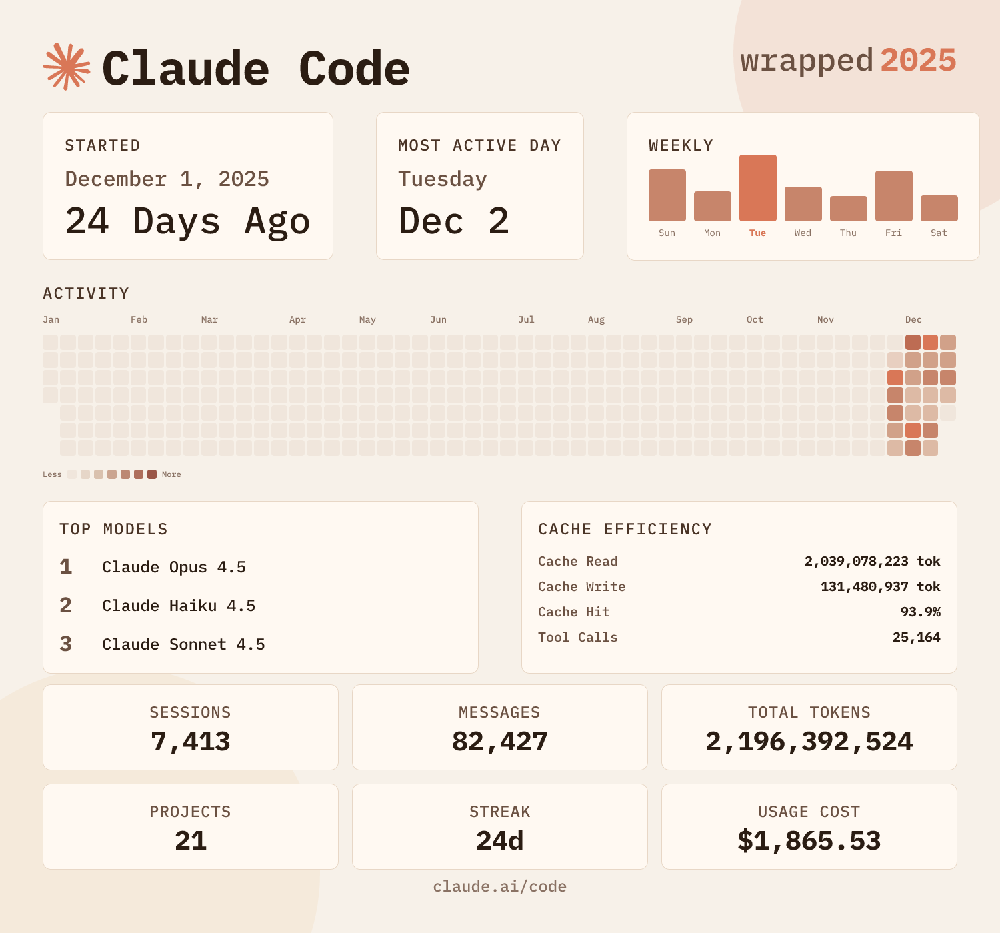

<div align="center">

# cc-wrapped

**Your year in code, beautifully visualized.**

<p>
  <strong>Credit:</strong> Built on top of
  <a href="https://github.com/moddi3/opencode-wrapped">opencode-wrapped</a>
  by moddi3 (<a href="https://x.com/moddi3io">@moddi3io</a>).
</p>
<p>
  Found this useful? Follow <a href="https://x.com/nummanali">@nummanali</a> for more AI tooling!
</p>

Generate a personalized "Spotify Wrapped"-style summary of your [Claude Code](https://claude.ai) usage.

[](LICENSE)
[](https://bun.sh)



</div>

---

## Installation

### Quick Start

Run directly without installing:

```bash
npx github:larkinwc/cc-wrapped
```

### Global Install

```bash
npm install -g github:larkinwc/cc-wrapped
```

Then run anywhere:

```bash
cc-wrapped
```

## Usage Options

| Option            | Description                                                      |
| ----------------- | ---------------------------------------------------------------- |
| `--year, -y`      | Generate wrapped for a specific year                             |
| `--export, -e`    | Export raw data to a portable JSON file                          |
| `--input, -i`     | Generate wrapped from one or more exported files (comma-separated) |
| `--help, -h`      | Show help message                                                |
| `--version, -v`   | Show version number                                              |

## Combining Data from Multiple Machines

If you use Claude Code on multiple computers, you can combine your usage data to generate a unified wrapped.

### Step 1: Export data from each machine

On each computer, run:

```bash
cc-wrapped --export ~/work-pc.json
cc-wrapped --export ~/home-laptop.json
```

This creates a portable JSON file containing all your usage data for that machine.

### Step 2: Combine and generate

Copy all exported files to one machine, then run:

```bash
cc-wrapped --input work-pc.json,home-laptop.json
```

The tool will:
- Merge all usage data
- Deduplicate entries automatically
- Show which sources contributed to the stats
- Generate a combined wrapped image

## Features

- Sessions, messages, tokens, projects, and streaks
- GitHub-style activity heatmap
- Top models and providers breakdown
- Usage cost (when available)
- Shareable PNG image
- Inline image display (Ghostty, Kitty, iTerm2, WezTerm, Konsole)
- Auto-copy to clipboard
- **Multi-machine support**: Export and combine data from multiple computers

## Terminal Support

The wrapped image displays natively in terminals that support inline images:

| Terminal                                   | Protocol       | Status                      |
| ------------------------------------------ | -------------- | --------------------------- |
| [Ghostty](https://ghostty.org)             | Kitty Graphics | Full support                |
| [Kitty](https://sw.kovidgoyal.net/kitty/)  | Kitty Graphics | Full support                |
| [WezTerm](https://wezfurlong.org/wezterm/) | Kitty + iTerm2 | Full support                |
| [iTerm2](https://iterm2.com)               | iTerm2 Inline  | Full support                |
| [Konsole](https://konsole.kde.org)         | Kitty Graphics | Full support                |
| Other terminals                            | —              | Image saved to file only    |

## Output

The tool generates:

1. **Terminal Summary** — Quick stats overview in your terminal
2. **PNG Image** — A beautiful, shareable wrapped card saved to your home directory
3. **Clipboard** — Automatically copies the image to your clipboard

## Data Source

Claude Code Wrapped reads data from your local Claude Code installation:

```
~/.claude/ (stats-cache.json, history.jsonl, transcripts)
```

No data is sent anywhere. Everything is processed locally.

## Building

### Development

```bash
# Run in development mode with hot reload
bun run dev
```

### Production Build

```bash
# Build for all platforms
bun run build
```

### Releasing

Releases are automated via [semantic-release](https://semantic-release.gitbook.io). Merging PRs with [conventional commits](https://www.conventionalcommits.org) to `main` triggers a release.

## Tech Stack

- **Runtime**: [Bun](https://bun.sh)
- **Image Generation**: [Satori](https://github.com/vercel/satori) + [Resvg](https://github.com/nicolo-ribaudo/resvg-js)
- **CLI UI**: [@clack/prompts](https://github.com/natemoo-re/clack)
- **Font**: IBM Plex Mono

## Contributing

Contributions are welcome! Please feel free to submit a Pull Request.

## License

MIT License - see [LICENSE](LICENSE) for details.

---

<div align="center">

Built for the Claude Code community

Credit: <a href="https://github.com/ryoppippi/ccusage">ccusage</a>

</div>
